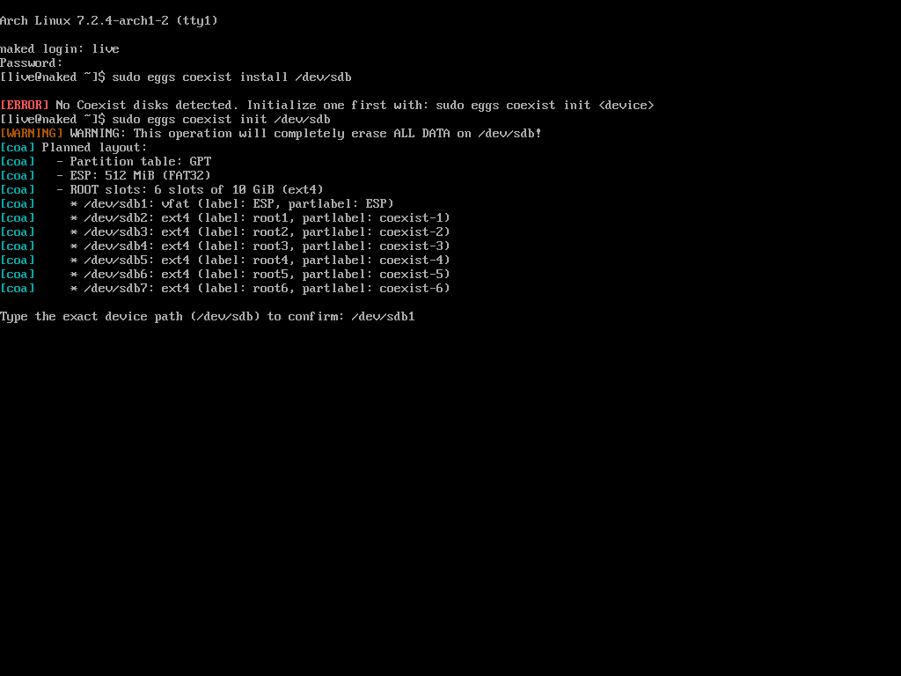
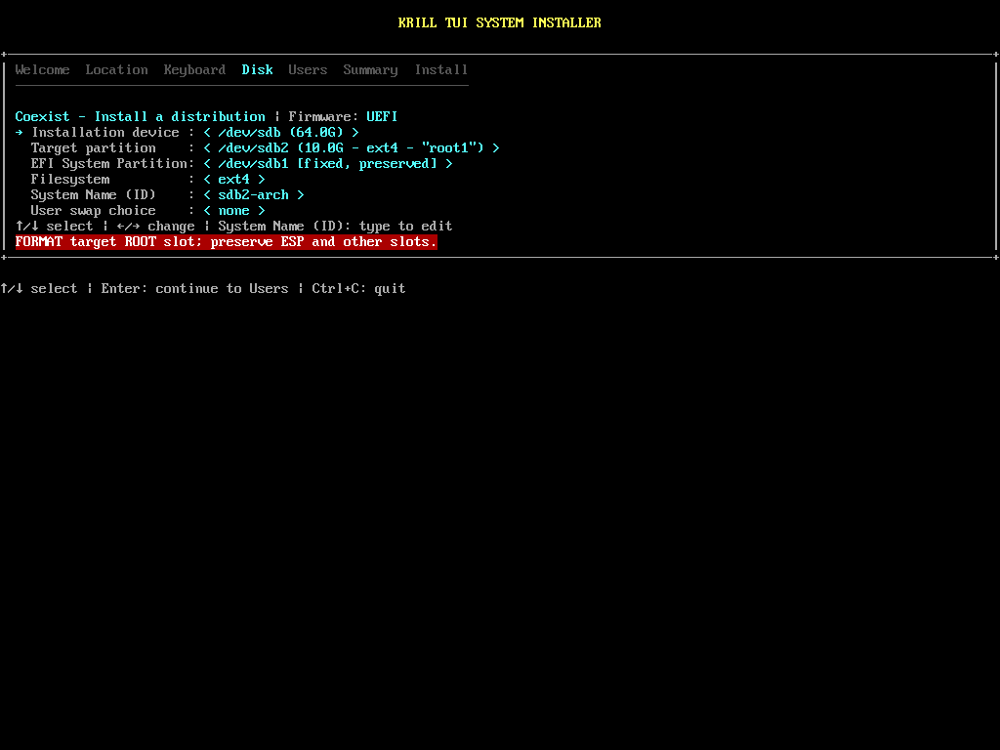
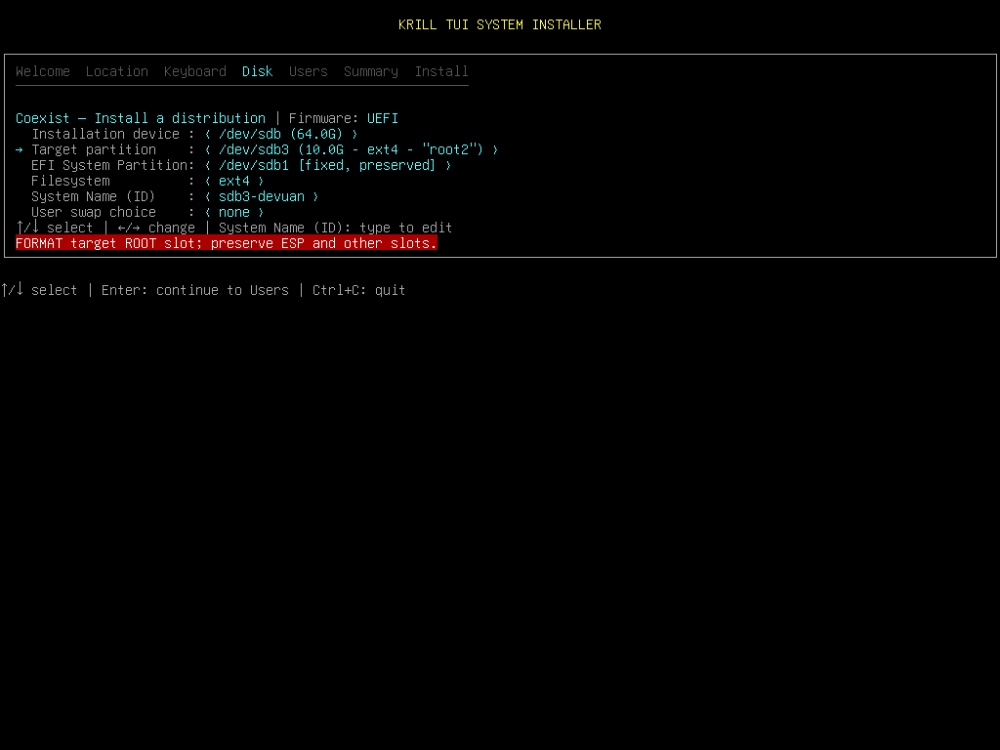
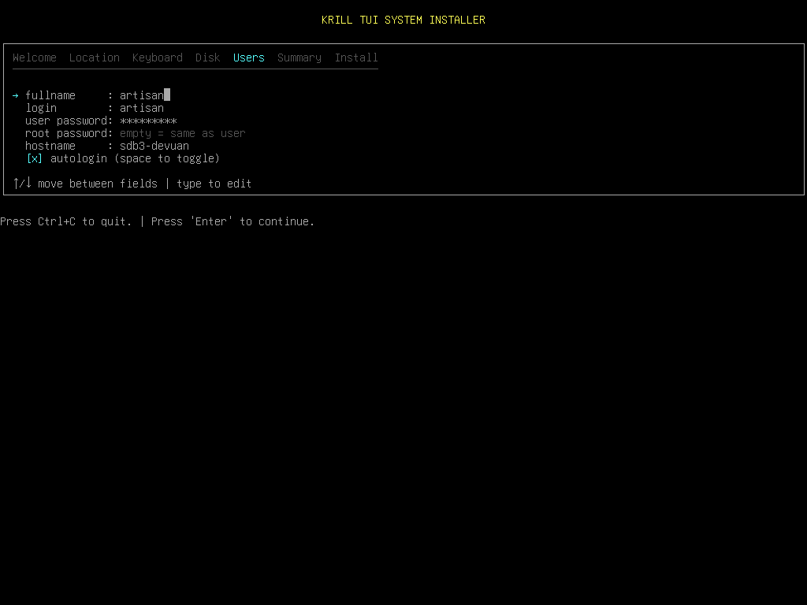
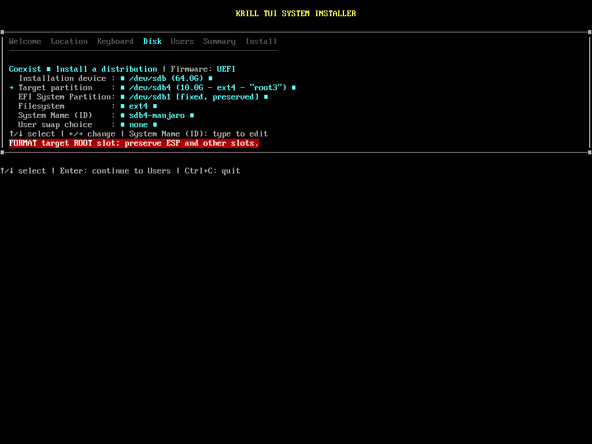
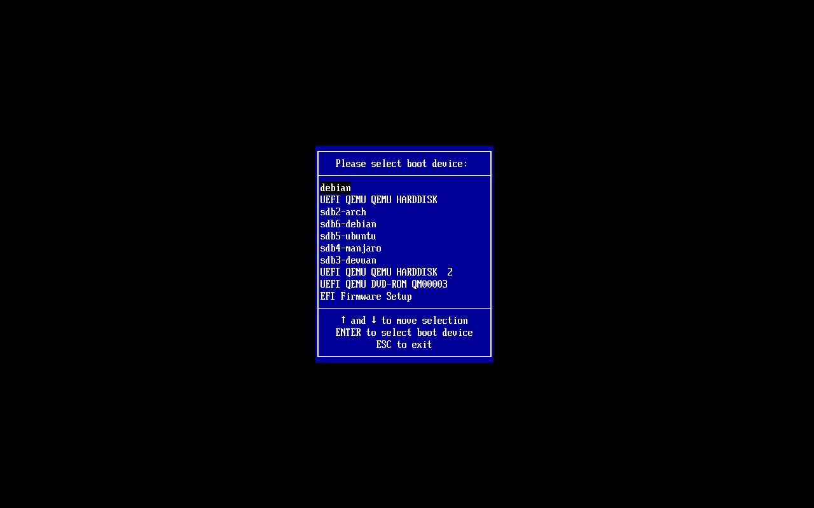

# Guida Pratica: Multi-Boot Linux con penguins-eggs e Krill Coexist

La nuova architettura **Pure Slots** di **Krill Coexist** (introdotta in `penguins-eggs v26.9.15`) consente di far convivere molteplici distribuzioni Linux completamente indipendenti su un unico disco fisso o virtuale UEFI, senza conflitti di bootloader, senza sovrapposizioni di filesystem e senza complesse configurazioni manuali.

Questa guida illustra la procedura passo-passo basata su un'installazione reale: dalla preparazione di un disco da 64 GB alla coesistenza di ben 5 distribuzioni diverse (**Arch Linux**, **Devuan**, **Manjaro**, **Ubuntu**, **Debian**).

---

## Panoramica dell'Architettura "Pure Slots"

Un disco preparato per la modalità Coexist adotta una struttura lineare e robusta:
1. **1 sola partizione ESP (EFI System Partition)**: da 512 MiB formattata FAT32 (`/dev/sdb1`), condivisa per i file di avvio UEFI ma isolata a livello di directory.
2. **N slot ROOT uniformi**: di dimensione uniforme (default 10 GiB ciascuno, oppure personalizzabile a partire da 4 GiB), formattati ext4 (o btrfs), etichettati inizialmente come `root1`, `root2`, `root3`, ecc. con PARTLABEL GPT `coexist-1`, `coexist-2`, ecc.
3. **`/home` native e indipendenti**: ogni distribuzione possiede la propria `/home` standard all'interno della partizione di root del proprio slot, eliminando alla radice ogni collisione di permessi utente o UID/GID.

Ogni sistema installato riceve un **System Name (ID)** univoco (ad es. `sdb2-arch`, `sdb3-devuan`), installa il proprio GRUB in `/boot/efi/EFI/<System_Name>` e registra una voce separata nella NVRAM della scheda madre.

---

## Fase 1: Inizializzazione del Disco con `eggs coexist init`

Avviando il sistema da una qualsiasi live creata con penguins-eggs (oppure direttamente da una sessione con `eggs` installato):

Se si tenta di lanciare l'installazione su un disco non ancora preparato (`sudo eggs coexist install /dev/sdb`), il sistema segnala che non sono presenti dischi Coexist e invita a inizializzarne uno.

Per inizializzare il disco target:
```bash
sudo eggs coexist init /dev/sdb
```
> **Nota sui parametri opzionali:**
> - `--size <GiB>`: imposta la dimensione di ciascuno slot ROOT (default: `10`).
> - `--fstype ext4|btrfs`: sceglie il filesystem degli slot (default: `ext4`).
> - `-y`, `--yes`: salta la richiesta di conferma interattiva (utile per script non presidiati).

Il comando calcola automaticamente la suddivisione geometrica:
- Tabella delle partizioni GPT.
- Partizione 1: ESP da 512 MiB FAT32 (`/dev/sdb1`).
- Slot ROOT da 10 GiB ciascuno (nel nostro disco da 64 GB vengono generati 6 slot: da `/dev/sdb2` a `/dev/sdb7`).
- Richiede la digitazione esplicita del device (`/dev/sdb`) per prevenire cancellazioni accidentali.



Al termine, il disco è pronto per accogliere qualsiasi distribuzione Linux.

---

## Fase 2: Installazione del Primo Sistema (es. Arch Linux)

Avviamo l'installer con:
```bash
sudo eggs coexist install
# oppure: sudo eggs sysinstall krill
```

Krill rileva istantaneamente il disco Coexist presente e apre la schermata di selezione partizioni in modalità Coexist:
- **Installation device**: selezioniamo `/dev/sdb`.
- **Target partition**: selezioniamo il primo slot libero `/dev/sdb2` (10.0G ext4 `"root1"`).
- **EFI System Partition**: `/dev/sdb1` viene contrassegnata come `[fixed, preserved]` (verrà usata per registrare l'avvio, senza essere formattata).
- **System Name (ID)**: Krill propone automaticamente `sdb2-arch` (adattato alla distro in esecuzione e al nome della partizione).
- Il banner inferiore conferma l'operazione sicura: **`FORMAT target ROOT slot; preserve ESP and other slots.`**



Proseguiamo con la schermata utenti e confermiamo. Al termine, Arch Linux sarà installato nel suo slot dedicato `/dev/sdb2` con il proprio bootloader UEFI registrato con l'etichetta `sdb2-arch`.

---

## Fase 3: Installazione del Secondo Sistema (es. Devuan)

Riavviando la macchina con la ISO live di un'altra distribuzione (nel nostro esempio **Devuan**), eseguiamo nuovamente:
```bash
sudo eggs coexist install
```

Nella scheda **Disk**:
- Selezioniamo lo slot successivo: `/dev/sdb3` (10.0G ext4 `"root2"`).
- Krill propone come ID di sistema: `sdb3-devuan`.
- L'ESP `/dev/sdb1` e il precedente slot `/dev/sdb2` rimangono intatti e protetti.



Passando alla scheda **Users**:
- Definiamo il nome utente e password.
- L'**hostname** viene automaticamente preconfigurato in corrispondenza del System Name (`sdb3-devuan`), consentendo di distinguere immediatamente i sistemi sia a terminale che in rete locale.
- È possibile abilitare l'autologin con la barra spaziatrice.



Completiamo l'installazione: Devuan viene installato nel secondo slot in pochi minuti.

---

## Fase 4: Popolamento degli Slot Successivi (Manjaro, Ubuntu, Debian...)

Ripetiamo la medesima procedura avviando le live delle altre distribuzioni desiderate:

Per **Manjaro**:
- Selezioniamo lo slot libero `/dev/sdb4` (`"root3"`).
- Krill preconfigura il System Name `sdb4-manjaro`.
- Procediamo con l'installazione.



Allo stesso modo, proseguiamo negli slot successivi:
- `/dev/sdb5` -> `sdb5-ubuntu`
- `/dev/sdb6` -> `sdb6-debian`

---

## Risultato Finale: Menu di Boot UEFI Multi-Distro

Al riavvio della macchina o della macchina virtuale, accedendo al Boot Menu del firmware UEFI (tasto F11/F12 o menu firmware OVMF/QEMU):



Tutte le distribuzioni compaiono nel menu di avvio del firmware con la loro voce dedicata:
- `sdb2-arch`
- `sdb3-devuan`
- `sdb4-manjaro`
- `sdb5-ubuntu`
- `sdb6-debian`

---

## Vantaggi Chiave di Questo Approccio

1. **Zero conflitti tra bootloader**: Ciascun sistema installa GRUB esclusivamente nella propria sottodirectory `/boot/efi/EFI/<System_Name>` e registra la propria voce NVRAM indipendente. Non esiste un "GRUB master" che rischia di corrompersi o che deve essere aggiornato ogni volta che un'altra distro aggiorna il proprio kernel.
2. **Sostituzione e reinstallazione pulita (`PURGE PREVIOUS`)**: Se in futuro si desidera rimpiazzare una distribuzione in uno slot (ad esempio sostituire Manjaro su `/dev/sdb4` con Fedora), Krill rileva la vecchia etichetta `sdb4-manjaro`, rimuove automaticamente la directory EFI corrispondente e la vecchia voce NVRAM (`PURGE PREVIOUS`), riformatta solo quello slot e installa la nuova distro senza toccare nessuno degli altri slot.
3. **Isolamento completo dei dati**: Ogni slot contiene nativamente il proprio `/home` e i propri file di configurazione. Aggiornamenti di sistema, cambi di librerie o pacchetti non possono in alcun modo influenzare le altre installazioni.
4. **Ispezione rapida con `eggs coexist info`**: In qualsiasi momento è possibile verificare lo stato degli slot con:
   ```bash
   eggs coexist info
   ```
   per visualizzare una tabella riassuntiva di tutti gli slot disponibili e occupati su ogni disco Coexist rilevato.
