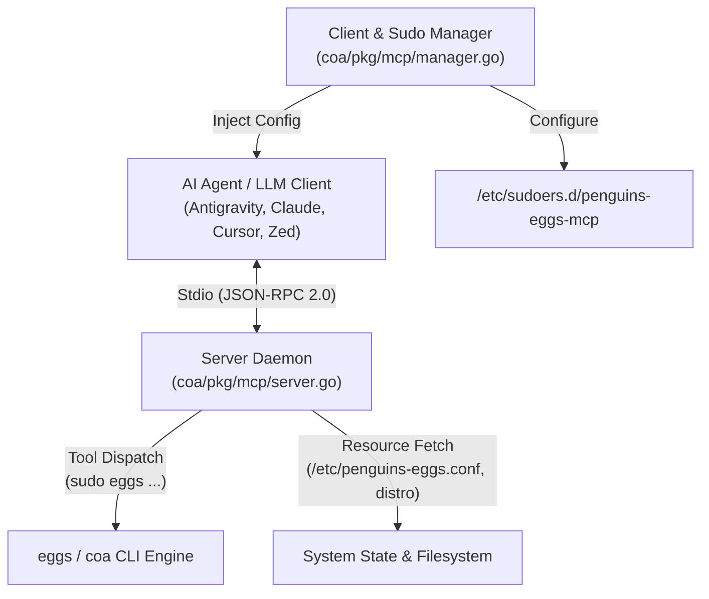

# 🤖 Architecture: Model Context Protocol (MCP) Server

`penguins-eggs` includes a native **Model Context Protocol (MCP)** server embedded directly inside the Go orchestrator (`coa`). MCP is an open standard (initiated by Anthropic) that defines how AI coding assistants and autonomous agents (such as Google DeepMind Antigravity CLI, Claude Desktop, Cursor, Zed, and Roo-Cline) discover and execute tools or read resources from external systems.

By embedding an MCP server into `eggs`, AI agents can inspect host configurations, trigger live ISO remastering flights, test installers, and manage artifacts natively through standardized JSON-RPC 2.0.

---

## 🏗️ Architecture Overview

The MCP implementation is located in `coa/pkg/mcp/` and consists of three core components:



| File | Component | Responsibility |
|---|---|---|
| [`server.go`](file:///home/artisan/forge/penguins-eggs/coa/pkg/mcp/server.go) | **Stdio JSON-RPC Daemon** | Handles the stdin/stdout JSON-RPC 2.0 loop, request routing, tool execution dispatching, and resource queries. |
| [`manager.go`](file:///home/artisan/forge/penguins-eggs/coa/pkg/mcp/manager.go) | **Client & Sudo Provisioner** | Manages `/etc/sudoers.d/penguins-eggs-mcp`, scans and updates client JSON config files, and handles process lifecycle (`status`, `stop`). |
| [`types.go`](file:///home/artisan/forge/penguins-eggs/coa/pkg/mcp/types.go) | **Protocol Definitions** | Strongly-typed Go structs for JSON-RPC 2.0 messages, tool schemas, and MCP resource payloads. |

---

## ⚡ Stdio JSON-RPC 2.0 Protocol Engine (`server.go`)

The MCP daemon is started via:
```bash
eggs mcp start
```

### 1. Protocol Cleanliness & Stream Safety
Because MCP communicates over standard input (`os.Stdin`) and standard output (`os.Stdout`), any arbitrary text or ANSI escape codes printed to `os.Stdout` would corrupt JSON-RPC parsing in the AI client.

To protect the stream:
- `utils.DisableColors = true` is set immediately upon server start.
- Commands executed on behalf of tools use `utils.ExecCaptureCombined()`, returning stdout and stderr within structured JSON responses rather than streaming directly to terminal stdout.

### 2. Supported JSON-RPC Methods

| Method | Protocol Phase | Action |
|---|---|---|
| `initialize` | Handshake | Returns protocol version (`2024-11-05`), server capabilities (`tools`, `resources`), and server name/version. |
| `ping` | Health Check | Returns an empty result acknowledgment. |
| `tools/list` | Discovery | Returns the full list of exposed tools with parameter types, descriptions, and required fields. |
| `tools/call` | Execution | Dispatches the tool call to the local `eggs` binary, handles privilege escalation, captures stdout/stderr, and returns the result. |
| `resources/list` | Resource Discovery | Lists static and dynamic system resources (`eggs://config`, `eggs://exclude-list`, `eggs://version`, `eggs://status`). |
| `resources/read` | Resource Fetch | Reads file content or system metadata and returns it as MIME `text/plain`. |

---

## 🛠️ Exposed MCP Tools

The server exposes seven granular tools that mirror the CLI hierarchy:

```
├── eggs_remaster    -> Live ISO flight (clone, crypted, compression, stop_after, debug)
├── eggs_sysinstall  -> System installer deployment (krill TUI, calamares GUI, unattended)
├── eggs_export      -> Remote artifact transfer to Proxmox (iso, pkg, log)
├── eggs_tools       -> Maintenance routines (clean, grub40, skel, build)
├── eggs_destroy     -> Workspace cleanup and lazy unmount
├── eggs_version     -> Version, architecture, and git commit query
└── eggs_exec        -> Safe arbitrary eggs CLI argument execution
```

### Privilege Handling in Tool Execution
- **Root Operations**: Commands like `eggs remaster`, `eggs sysinstall`, `eggs tools clean/grub40/skel`, and `eggs destroy` are automatically prepended with `sudo`.
- **User-Level Operations**: Commands like `eggs tools build` strictly omit `sudo` to prevent developer workspace file ownership pollution (honoring project development policies).

---

## 📑 Exposed MCP Resources

AI assistants can directly inspect system configuration and environment state:

- **`eggs://config`**: Reads `/etc/penguins-eggs.conf` (main configuration).
- **`eggs://exclude-list`**: Reads `/etc/penguins-eggs.d/custom.exclude.list` (custom squashfs exclusions).
- **`eggs://version`**: Returns the active `eggs version` output.
- **`eggs://status`**: Gathers real-time environment telemetry using `distro.NewDistro()`, `uname -a`, and `utils.IsLive()`.

---

## 🔧 Client Management & Security Model (`manager.go`)

### 1. Passwordless Sudo Rule Provisioning
When `sudo eggs mcp enable` is run, `coa/pkg/mcp/manager.go` creates `/etc/sudoers.d/penguins-eggs-mcp` with file mode `0440`:

```sudoers
# penguins-eggs MCP passwordless sudo access
ALL ALL=(ALL) NOPASSWD: /usr/bin/eggs, /usr/local/bin/eggs, /usr/bin/coa, /usr/local/bin/coa, /path/to/binary
```

This grants the AI agent the exact permission needed to run remaster flights and installers without prompting for a terminal password.

### 2. Multi-Client Auto-Discovery
`manager.go` discovers user home directories (inspecting `SUDO_USER` and `/root`) and injects the `penguins-eggs` MCP server configuration into target JSON configurations:

```json
{
  "mcpServers": {
    "penguins-eggs": {
      "command": "/usr/bin/eggs",
      "args": ["mcp", "start"]
    }
  }
}
```

Target configuration matrix:
- **Antigravity CLI**: `~/.config/antigravity/mcp.json`
- **Claude Desktop**: `~/.config/Claude/claude_desktop_config.json`
- **Roo-Cline (VSCode Server)**: `~/.vscode-server/data/User/globalStorage/rooveterinaryinc.roo-cline/settings/cline_mcp_settings.json`
- **Roo-Cline (VSCode Local)**: `~/.config/Code/User/globalStorage/rooveterinaryinc.roo-cline/settings/cline_mcp_settings.json`
- **Cursor Editor**: `~/.cursor/mcp.json`
- **Zed Editor**: `~/.config/zed/settings.json`

File ownership (`UID`/`GID`) is automatically preserved for non-root users when provisioning under `sudo`.

### 3. Cleanup & Lifecycle Control
- `eggs mcp disable`: Removes the `penguins-eggs` entry from client configurations and unlinks `/etc/sudoers.d/penguins-eggs-mcp`.
- `eggs mcp status`: Inspects the filesystem and process table (`pgrep -f 'mcp start'`) to report rule, config, and listener status.
- `eggs mcp stop`: Broadcasts `SIGTERM` to any lingering background listener processes.
