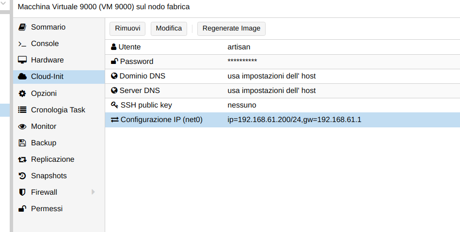

# download the image
wget https://cloud-images.ubuntu.com/focal/current/focal-server-cloudimg-amd64.img

# create a new VM
sudo qm create 9000 --memory 4096 --net0 virtio,bridge=vmbr0

# import the downloaded disk to local-lvm storage
sudo qm importdisk 9000 focal-server-cloudimg-amd64.img local

# finally attach the new disk to the VM as scsi drive
sudo qm set 9000 --scsihw virtio-scsi-pci --scsi0 local:9000/vm-9000-disk-0.raw

# add cdrom cloudinit
sudo qm set 9000 --ide2 local:cloudinit

# set user and password
open Cloud-init in the graphis interface of proxmox ve and set user and password

# to boot directly from the image
sudo qm set 9000 --boot c --bootdisk scsi0

# Configure a serial console and use it as a display
sudo qm set 9000 --serial0 socket --vga serial0

# expand the disk to your needs
