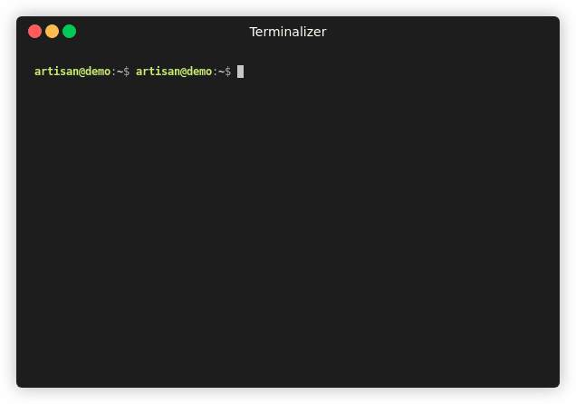
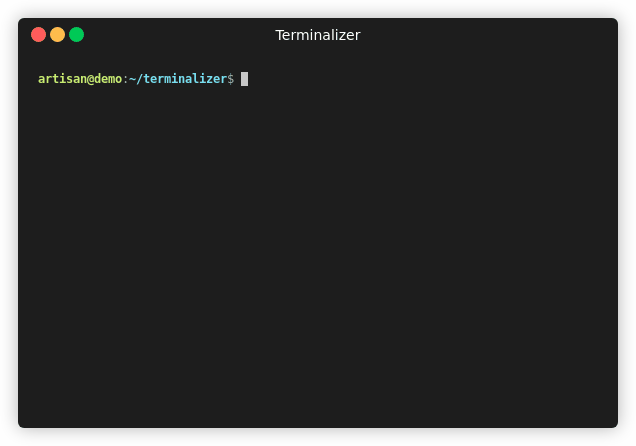

penguins-eggs
=============

## Penguin&#39;s eggs are generated and new birds are ready to fly...
[](https://github.com/pieroproietti/penguins-eggs)
[](https://penguins-eggs.net)
[](https://penguins-eggs.net/docs/Tutorial/users-guide)
[](https://npmjs.org/package/penguins-eggs)
[](https://sourceforge.net/projects/penguins-eggs/files/DEBS)
[](https://sourceforge.net/projects/penguins-eggs/files/PKGBUILD)
[](https://sourceforge.net/projects/penguins-eggs/files/ISOS)

# Examples of terminal sessions
Here you will find same terminal lesson in gif format. Download it and see the lesson.

## install eggs package (.deb)
Install eggs by dpkg or gdebi.

```sudo dpkg -i eggs_v7-6-70-amd64.deb```


## install prerequisites 
Installing deb packages used by eggs to produce ISOs. 

```sudo eggs prerequisites```



## produce an eggs (create a livecd)
Creating a new iso image of your system.

```sudo eggs produce -vf```


## export iso liveCd
Exporting ISOs, and others via ssh. 
```sudo eggs export:iso -c```



## getting help
eggs have all the kinds of help you can aspect from a modern cli software!
```eggs```
```eggs produce -h```


## cli installer
On naked system you can't use calamares installer to install the system, but again is possible to install it using the cli installer included in eggs.

```sudo eggs install```


## update eggs (deb)
You can update eggs (deb version) from sourceforge directly from eggs. Give the command:
```sudo eggs update -i```
and select the version you want install


# That's all Folks!
No need other configurations, penguins-eggs are battery included or better - as in the real - live is inside! :-D

## More informations
There is [user's manual](https://penguins-eggs.net/docs/Tutorial/users-guide) and same other documentation in our [repository](https://github.com/pieroproietti/penguins-eggs/documents).

Contact me via [gitter](https://gitter.im/penguins-eggs-1/community), or open an [issue](https://github.com/pieroproietti/penguins-eggs/issues) on github.

* Penguins' eggs site: [Penguins' eggs](https://penguins-eggs.net)
* facebook personal: [Piero Proietti](https://www.facebook.com/thewind61)
* facebook group:  [Penguins' eggs](https://www.facebook.com/groups/128861437762355/)
* facebook page:  [Penguins' eggs](https://www.facebook.com/penguinseggs)
* mail: piero.proietti@gmail.com


## Copyright and licenses
Copyright (c) 2017, 2020 [Piero Proietti](https://penguins-eggs.net/about-me.html), dual licensed under the MIT or GPL Version 2 licenses.
