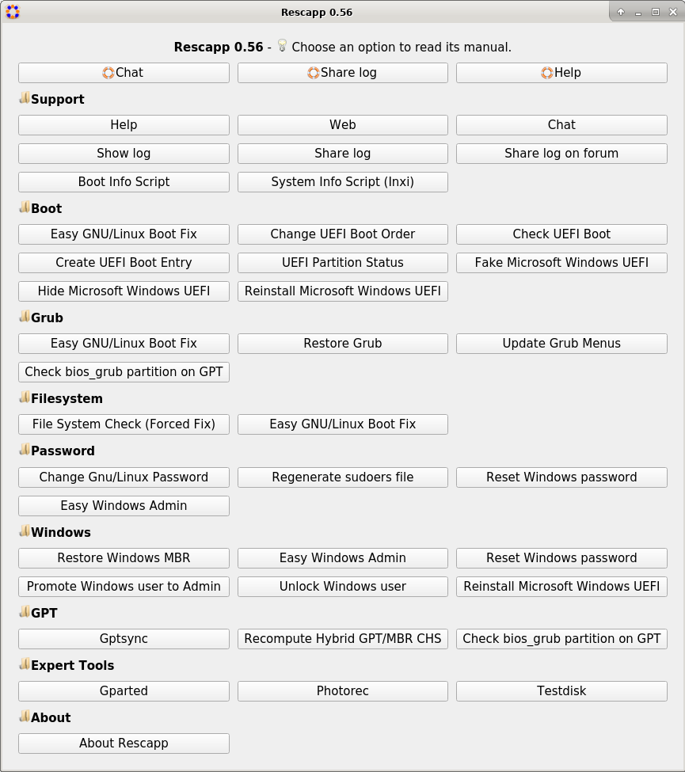
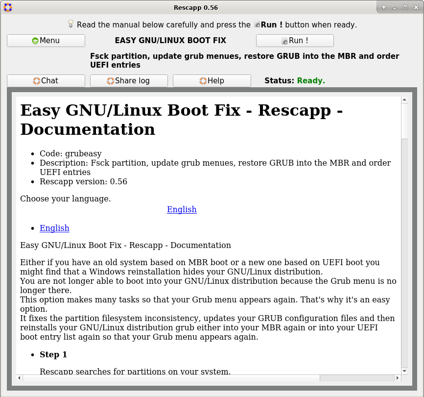
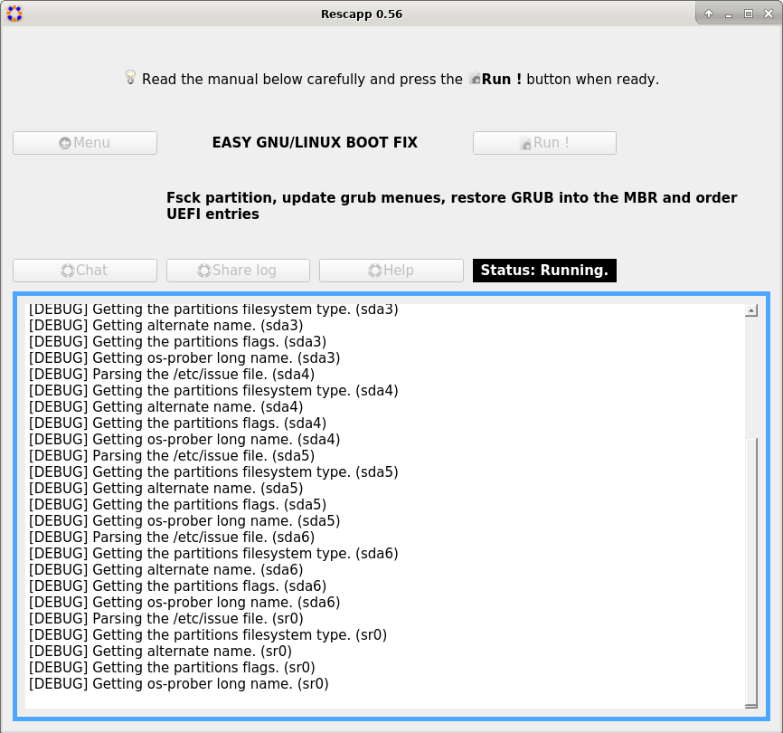
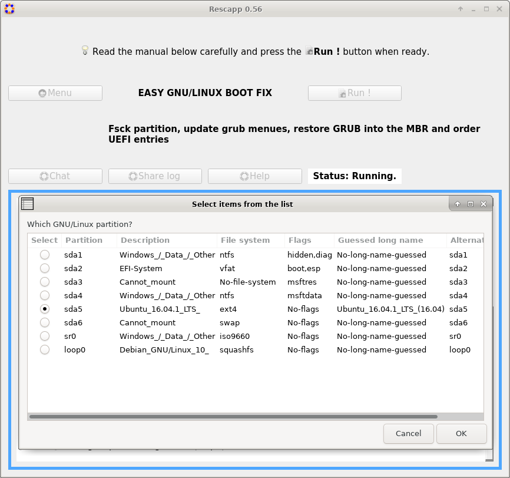
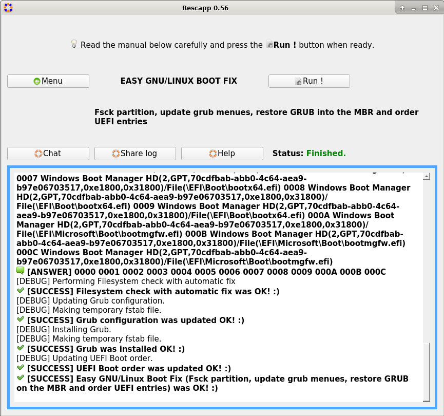

The main purpose of **Rescapp**, **is** to provide the user with **a graphical rescue tool** that will 
assist him to regain access to a computer that has become non-bootable.

You will be guided through the different options, as
Rescapp is a rescue "Wizard", providing inline help, as well as assistance
via chat or via the support forums.

Rescapp, is a collection of bash scripts, and makes use of Python3 and also
QT5.

Rescapp, is also available on a live Debian cd/dvd/usb ISO, known as Rescatux.

For full documentation and features, please visit the Rescatux website:

https://www.rescatux.org

**If you are an end user please use [Rescatux](https://www.rescatux.org) instead of trying to install Rescapp into a live cd on yourself.**

# Rescapp features

## GNU/Linux options

* Change Gnu/Linux Password : Change a user's password
* File System Check (Forced Fix) : File System Check (Forced Fix)
* Easy GNU/Linux Boot Fix : Fsck partition, update grub menues, restore GRUB into the MBR and order UEFI entries

* Restore Grub : Restore GRUB into the MBR
* Regenerate sudoers file : Define a new sudoers file
* Update Grub Menus : Update GRUB Configuration File

## UEFI Boot specific options

* UEFI Partition Status : Check UEFI partition status
* Check UEFI Boot : Check if Rescatux has boot in UEFI mode
* Create UEFI Boot Entry : Create a new UEFI Boot entry out of your EFI files
* Change UEFI Boot Order : Change UEFI Boot order

* Reinstall Microsoft Windows UEFI : Reinstall Microsoft Windows UEFI boot entries
* Fake Microsoft Windows UEFI : Fake Microsoft Windows UEFI boot entry
* Hide Microsoft Windows UEFI : Hide Microsoft Windows UEFI boot entry and define default fallback one.

## Windows password and role related options

* Easy Windows Admin : Promote to Admin, Reset Windows (NT,200x,XP,Vista,Seven) password and unlock user
* Reset Windows password : Reset Windows (NT,200x,XP,Vista,Seven,10) password
* Promote Windows user to Admin : Promote Windows (NT,200x,XP,Vista,Seven,10) user to Administrator
* Unlock Windows user : Unlock Windows (NT,200x,XP,Vista,Seven,10) user

## Other options

* Boot Info Script : Boot Information Script
* Check bios_grub partition on GPT : Check if there is a bios_grub partition on a GPT disk
* Gptsync : Create an hybrid MBR inside a GPT partition (Gptsync)
* Recompute Hybrid GPT/MBR CHS : Recompute CHS values on an hybrid GPT/MBR partitiont table
* Restore Windows MBR : Restore generic MBR code so that Windows boots again
* System Info Script (Inxi) : System Info Script (Inxi)

## Support features

* Chat : Get online human help (chat)
* Help : Help on using Rescapp
* Share log : Share Rescatux logs. It generates a pastebin in paste.debian.net and shows it to you so that you can copy and paste the url in the chat.
* Share log on forum : Share Rescatux logs on a forum. It generates a temporary file ready to copy and paste on your favourite forum (ubuntuforums.org and others).
* Show log : Show Rescatux logs so that you can ask help and supporters can know what happens when you run Rescatux options
* Web : Access online Rescatux website

## External tools

Note: These features are just launchers of external tools and are not enforced.
If your system does not have them installed they won't work.

* Gparted : GParted is a free partition editor for graphically managing your disk partitions.
* Testdisk : Testdisk is a text wizard drive program for rescuing disks, partitions, and files.
* Photorec : Photorec is a text wizard drive program for rescuing files. Despite its name it recovers much more files than photo files.

# More information about Rescapp

To know how to install Rescapp, please read the INSTALL file in the source code tarball.

To know how to develop Rescapp or integrate it in your GNU/Linux distribution, please read the DEVELOPMENT file in the source code tarball.

To know how to publish Rescapp, please read the PUBLISH file in the source code tarball.

If you happen to find a bug in Rescapp, please use the issue tracker on github:

https://github.com/rescatux/rescapp/issues

If you happen to find a bug in the chntpw package provided by rescatux, please use the
issue tracker on github:

https://github.com/rescatux/chntpw/issues

Please remember to use the correct issue tracker for the package that you have found
an issue with, as this saves time in having to move it to the correct location.
